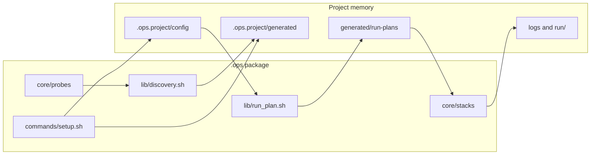

# Architecture

## Purpose

Ops is a Bash orchestration package: install once per machine, run `ops setup` per repository, then use runtime commands that read project state instead of hard-coded project scripts.

## Entry points

| Entry | Role |
| --- | --- |
| Parent repo `ops.sh` | Sets `OPS_PROJECT_ROOT`, execs `.ops/core/main.sh` |
| Global `ops` (after `ops install`) | Walks up for `.ops/core/main.sh` or uses installed package |
| `.ops/core/main.sh` | Dispatches to `core/commands/<command>.sh` |

Command registration lives in `core/main.sh` (`case "${COMMAND}"`).

## Data flow



1. **Discovery** — scans workspace; writes `discovery.json`.
2. **Setup** — resolves ambiguity; writes `config/*.json` and may update `.ops.yaml`.
3. **Run plan** — `run_plan_generate_json` builds `generated/run-plans/<service>.<action>.json`.
4. **Execution** — `run.sh` / `start.sh` dispatch to stack strategies or overrides.

## Package layout

```text
.ops/
  core/
    main.sh           # CLI router
    commands/         # One script per top-level command
    lib/              # Shared libraries (sourced, not executed)
    stacks/           # Per-stack runtime strategies
    probes/           # Discovery fingerprint scripts
  schemas/            # JSON Schema for config fragments
  templates/          # Default profile/setup JSON
  docs/               # This documentation tree
```

## Config sources (migration period)

Runtime prefers `.ops.project/config` when present, with `.ops.yaml` as fallback. See [boundaries.md](boundaries.md) and [reference/config-files.md](reference/config-files.md).

## Action resolution

See [reference/action-resolution.md](reference/action-resolution.md). Implementation: `core/lib/run_plan.sh` (`run_plan_generate_json`).

## Versioning

`OPS_CORE_VERSION` is set in `core/main.sh`. Installed global copies record metadata in `.ops-install-source` at the package root.

## See also

- [boundaries.md](boundaries.md)
- [../PROJECT_AIMS.md](../PROJECT_AIMS.md)
- [core/run-plan.md](core/run-plan.md)
