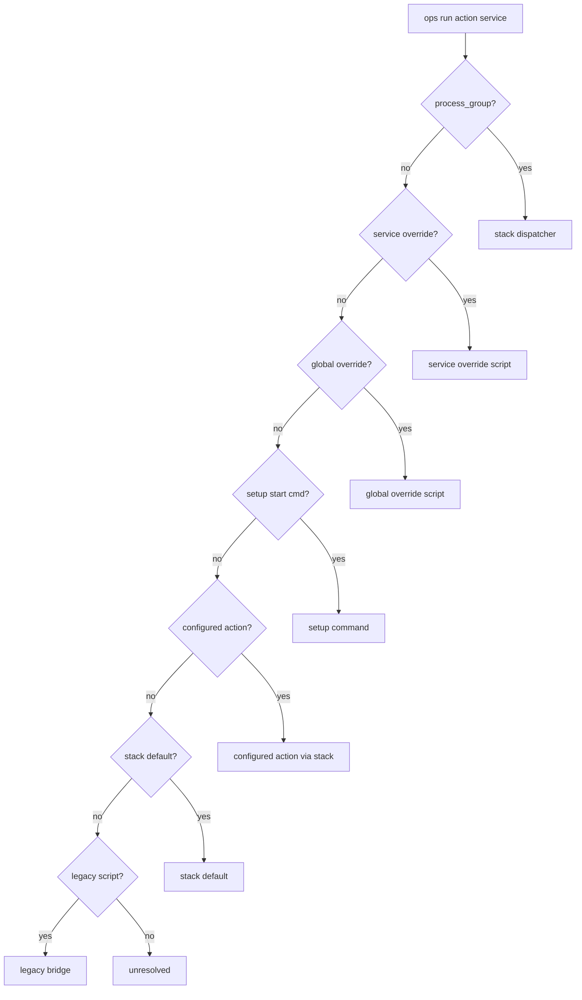

# Action resolution

## Purpose

How `ops run` and `ops show` choose a runner for `<action>` on `<service_id>`.

## Implementation

`core/lib/run_plan.sh` — `run_plan_generate_json`

## Precedence (highest first)

| Order | Strategy | Condition |
| --- | --- | --- |
| 1 | `stack` (managed) | `runner.kind` is `process_group` or `compose` |
| 2 | `service_override` | `.ops/commands/<service_id>/<action>.sh` executable |
| 3 | `global_override` | `.ops/commands/<action>.sh` executable |
| 4 | `setup_command` | `start` and setup has start command |
| 5 | `configured_action` | Project config or YAML fallback `actions.<action>` non-empty |
| 6 | `stack_default` | Default from `run_plan_stack_default_command` |
| 7 | `legacy_bridge` | Entry in `scripts/commands.sh` |
| 8 | `unresolved` | No runner found |

## Diagram

## Artifacts

Run plan JSON written to:

`.ops.project/generated/run-plans/<service_id>.<action>.json`

Fields include `selected_strategy`, `selected_cmd`, `stack_file`, override paths, log/pid paths.

## See also

- [../core/run-plan.md](../core/run-plan.md)
- [../commands/show.md](../commands/show.md)
